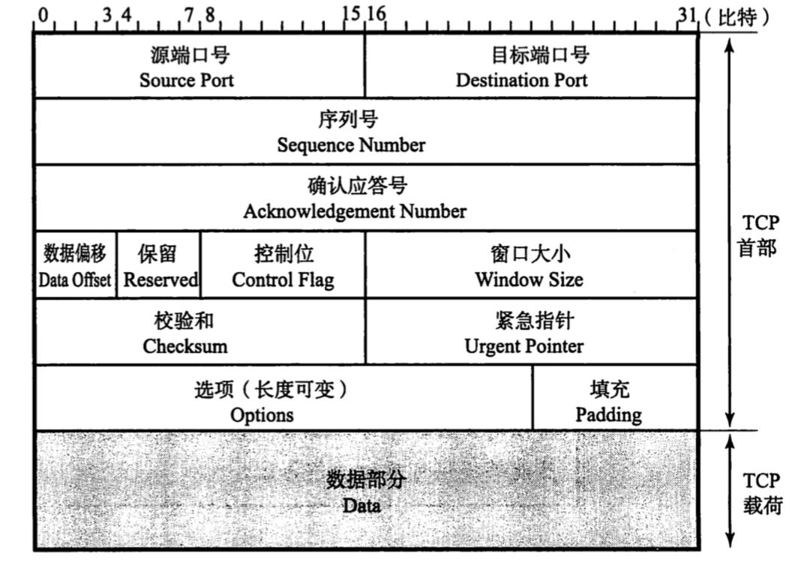
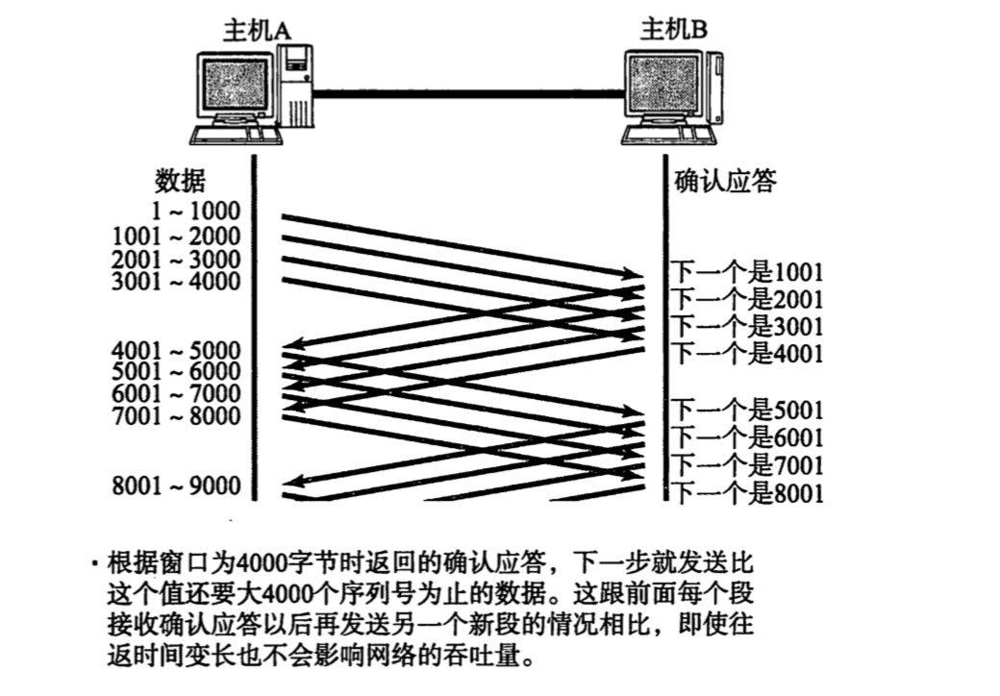
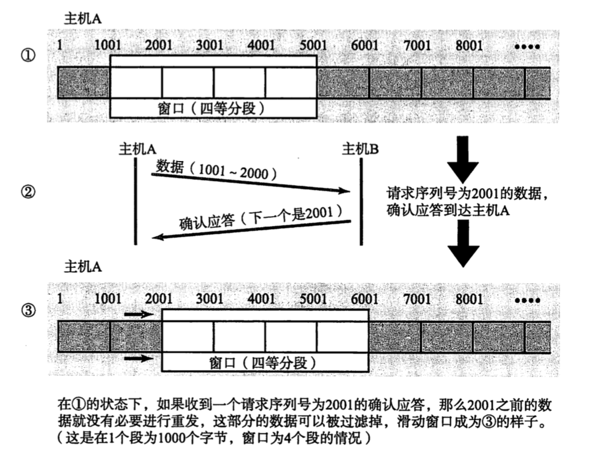
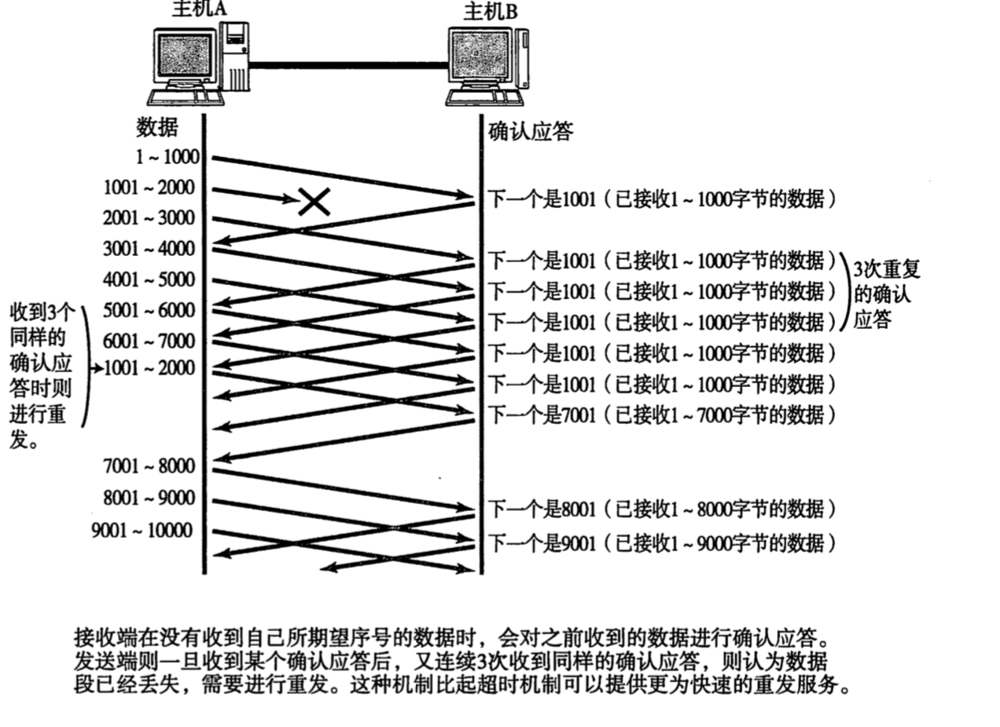
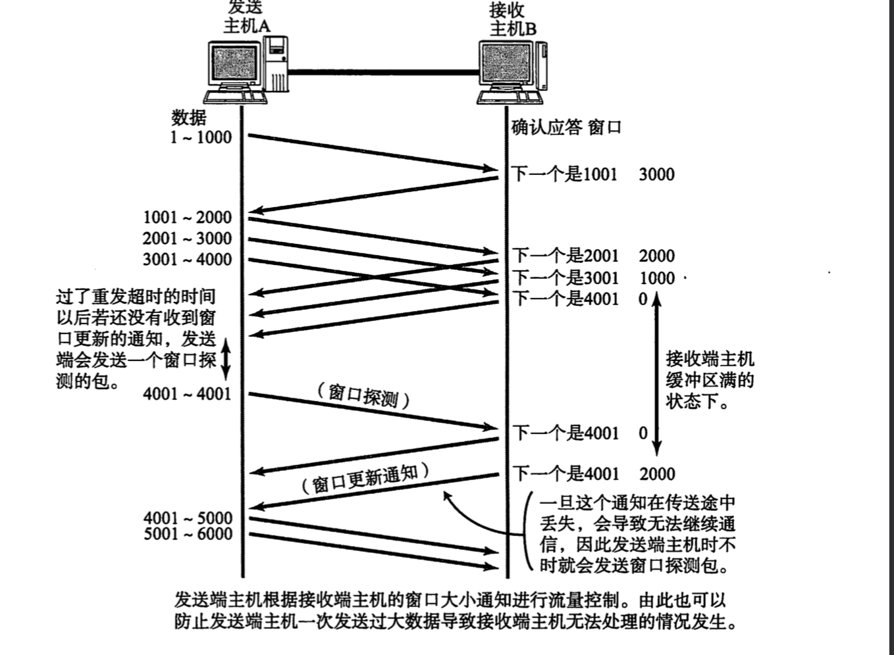
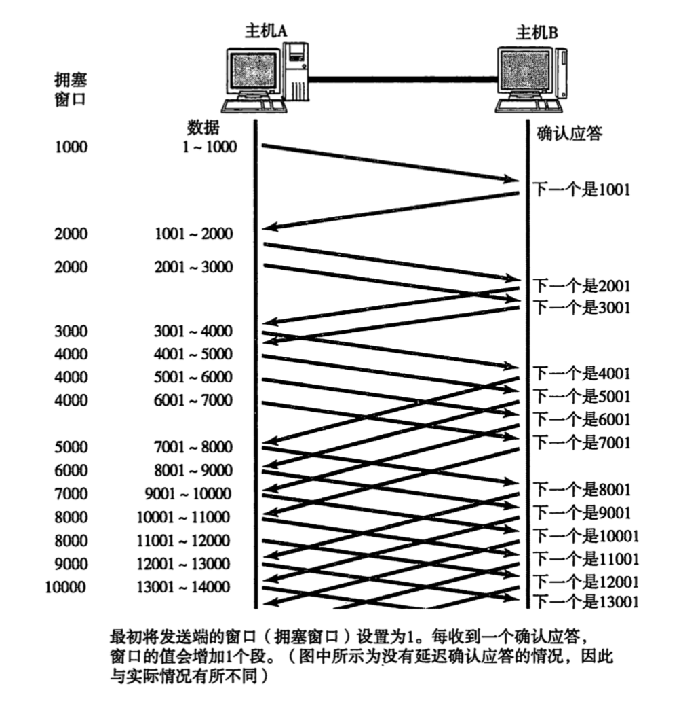
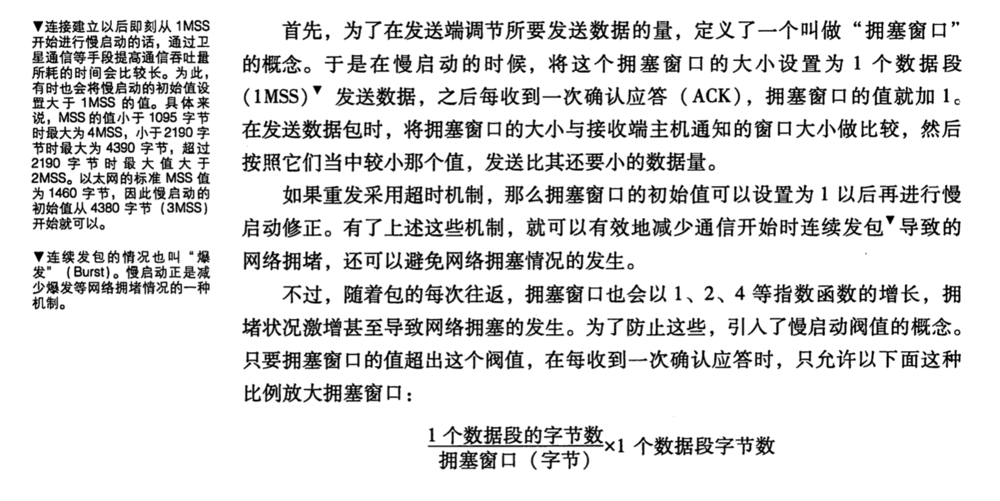
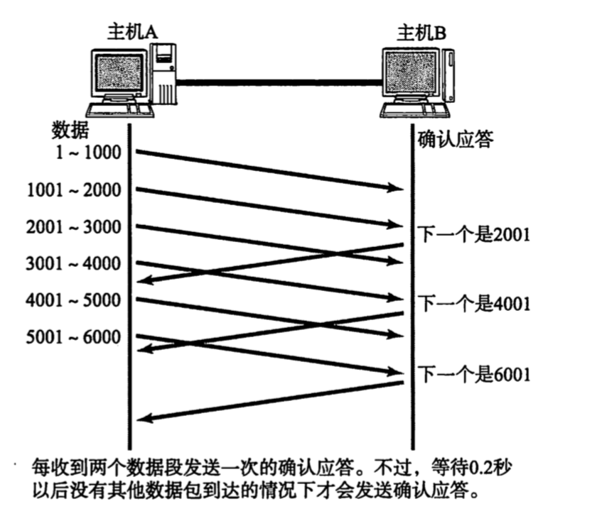
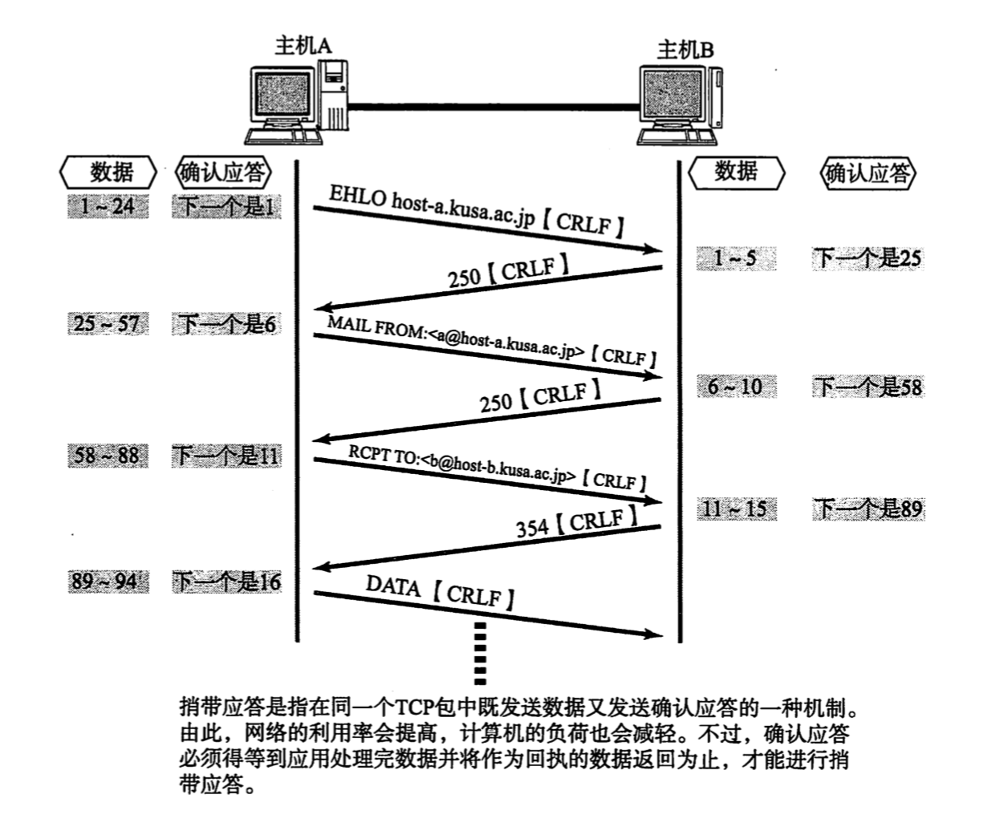

## TCP首部格式

```
    0                   1                   2                   3
    0 1 2 3 4 5 6 7 8 9 0 1 2 3 4 5 6 7 8 9 0 1 2 3 4 5 6 7 8 9 0 1
   +-+-+-+-+-+-+-+-+-+-+-+-+-+-+-+-+-+-+-+-+-+-+-+-+-+-+-+-+-+-+-+-+
   |          Source Port          |       Destination Port        |
   +-+-+-+-+-+-+-+-+-+-+-+-+-+-+-+-+-+-+-+-+-+-+-+-+-+-+-+-+-+-+-+-+
   |                        Sequence Number                        |
   +-+-+-+-+-+-+-+-+-+-+-+-+-+-+-+-+-+-+-+-+-+-+-+-+-+-+-+-+-+-+-+-+
   |                    Acknowledgment Number                      |
   +-+-+-+-+-+-+-+-+-+-+-+-+-+-+-+-+-+-+-+-+-+-+-+-+-+-+-+-+-+-+-+-+
   |  Data |           |U|A|P|R|S|F|                               |
   | Offset| Reserved  |R|C|S|S|Y|I|            Window             |
   |       |           |G|K|H|T|N|N|                               |
   +-+-+-+-+-+-+-+-+-+-+-+-+-+-+-+-+-+-+-+-+-+-+-+-+-+-+-+-+-+-+-+-+
   |           Checksum            |         Urgent Pointer        |
   +-+-+-+-+-+-+-+-+-+-+-+-+-+-+-+-+-+-+-+-+-+-+-+-+-+-+-+-+-+-+-+-+
   |                    Options                    |    Padding    |
   +-+-+-+-+-+-+-+-+-+-+-+-+-+-+-+-+-+-+-+-+-+-+-+-+-+-+-+-+-+-+-+-+
   |                             data                              |
   +-+-+-+-+-+-+-+-+-+-+-+-+-+-+-+-+-+-+-+-+-+-+-+-+-+-+-+-+-+-+-+-+

                            TCP Header Format
```




- 源端口号

- 目标端口号

- 序列号

  序列号不会从0或1开始，而是在建立连接时由计算机生成的随机数作为其初始值，通过SYN包传给接收端主机。然后再将每转发过去的字节数累加到初始值上表示数据的位置。此外，在建立连接和断开链接时发送的SYN包和FIN包虽然不携带数据，但也会作为一个字节增加对应的序列号。

- 确认应答号

- 数据偏移

  TCP首部的长度

- 保留

  一般设置为0

- 控制位

  字段长8位，每一位从左到右分别为CWR、ECE、URG、ACK、PSH、RST、SYN、FIN。这些控制标识也叫控制位。

  - CWR（Congestion Window Reduced）

    CWR标志与后面的ECE标志都用于IP首部的ECN字段。ECE标志为1时，则通知对方已将拥塞窗口缩小。

  - ECE（ECN-Echo）

  - URG（Urgent Flag）

  - ACK（Acknowledgement Flag）

  - PSH（Push Flag）

  - RST（Reset Flag）

  - SYN（Synchronize Flag）

  - FIN（Fin Falg）

- 窗口大小

- 校验和

- 紧急指针

- 选项

## TCP的特点及目的

​	为了通过ip数据报实现可靠性传输，需要考虑很多事情，例如数据的破坏、丢包、重复以及分片顺序混乱等问题。如不能解决这些问题，也就无从谈起可靠性传输。

​	tcp通过检验和、序列号、确认应答、重发控制、连接管理以及窗口控制等机制实现可靠性传输

## 通过确认应答和序列号提高可靠性

​	在tcp中当发送端的数据到达接收主机时，接收端主机会返回一个已收到消息的通知。这个消息叫确认应答（ACK）

确认应答（ACK）:Positive Acknowled-gement(意指已接收)

否定确认应答（NACK）:Negative Acknowl-edgement

​	确认应答、重发控制以及重复控制都可以通过序列号实现。

序列号

```
序列号是按顺序给发送数据的每一个字节(8位字节)都标上号码的编号。接收端查询接收数据TCP首部中的序列号和数据长度，将自己下一步应该接收的序列号作为确认应答返送回去。就这样通过序列号和确认应答，tcp可以实现可靠传输。
```

## 重发超时如何确定

​	超时重发要考虑往返时间和偏差（实际值稍大于这两个值的和）。

​	在BSD的unix和windows系统中，超时都以0.5为单位进行控制，因此重发超时都是0.5s的整数倍。由于最初的数据包还不知道往返时间，所以重发超时一般设置为6s左右。

​	数据被重发之后还是收不到确认应答，则进行再次发送。此时等待确认应答时间将会以2倍、4倍的指数函数延长。

​	数据包不会被无限、反复的重发。达到一定重发次数之后，仍未收到确认应答会判断为网络或对端主机异常，强制关闭链接。并且通知应用通信异常强行终止。

​	偏差的最小值是0.5s，因此最小重发时间至少是1s。

## 连接管理

​	tcp提供面向有连接的通信传输。面向有连接是指在数据通信开始之前先做好通信两端之间的准备工作。（udp是一种面向无连接的通信协议）

​	3次握手4次挥手

## tcp以段为单位发送数据

​	在建立tcp连接的同时，也可以确定发送数据包的单位。也成为“最大消息长度”（MSS:Maximum Segment Size）。最理想的情况是，最大消息长度正好是IP中不会被分片处理的最大数据长度。

​	tcp在传送大量数据时，是以MSS的大小将数据进行分割发送。重发时也是以MSS为单位

​	MSS是3次握手的时候，在两端主机之间被计算得出。两端主机在发出建立连接请求时，会在TCP首部写入MSS选项，告诉对方自己的接口能够适应的MSS的大小。然后在两者之间选择一个较小值投入使用。

## 利用窗口控制提高速度

​	为每个数据包进行确认应答的缺点是，包的往返时间越长，网络的吞吐量越差



​	窗口大小是指无需等待确认应答而可以继续发送数据的最大值。（上图窗口为4个段）

​	这个机制实现了使用大量的<font color=red>缓冲区</font>，通过对多个段同时进行确认应答的功能。

```
缓冲区（Buffer）在此处表示临时保存收发数据的场所。通常是在计算机内存中开辟的一部分空间。
```

​		当收到确认应答的情况下，将窗口滑动到确认应答中的序列号的位置。这样可以	顺序地将多个段同时发送提高通信性能。这种机制也被称为滑动窗口控制。



## 窗口控制与重发控制



## 流控制

​	TCP首部中，专门有一个字段用来通知窗口大小，接收主机将自己可以接收的缓冲区大小放入这个字段中通知给发送端。这个值越大，说明网络的吞吐量越大。

​	不过，接收端的这个缓冲区一旦面临数据溢出时，窗口大小的值也会随之被设置为一个更小的值通知给发送端，从而控制数据发送量。也就是说，发送端主机会根据接收端主机的指示，对发送数据的量进行控制。这也形成了一个完整的TCP控制流程（流量控制）。



## 拥塞控制

​	有了TCP的窗口控制，收发主机之间即使不再以一个数据段为单位发送确认应答，也能够连续发送大量数据包。然而，如果在通信刚开始时就发送大量数据，也可能会引发其他问题。

​	一般来说，计算机网络都处在一个共享的环境。因此也有可能会因为其他主机之间的通信使得网络拥堵。在网络出现拥堵时，如果突然发送一个较大量的数据，极有可能会导致整个网络的瘫痪。

​	TCP为了防止改问题，在通信一开始时就会通过一个叫慢启动的算法得出数值，对发送数据量进行控制。





## 提高网络利用率的算法

### Nagle算法

​	改算法是指发送端即使还有应该发送的数据，但如果这部分数据很少的话，则进行延迟发送的一直处理机制。（需满足下列任意一种条件才能发送数据，如果两个条件都不满足，那么暂时等待一段时间以后再进行数据发送。）

- 已发送的数据全部收到确认应答时
- 可以发送最大段长度(MSS)的数据时

### 延迟确认应答

​	接收数据的主机如果每次都立刻回复确认应答的话，可能会返回一个较小的窗口，因为刚接受完数据，缓冲区已满。

​	当某个接收端收到这个小窗口的通知后，会以它为上限发送数据，<font color=red>从而又降低了网络的利用率</font>。为此。引入了一个方法，那就是收到数据以后并不立即返回确认应答，而是延迟一段时间的机制。

- 在没收到2*最大段长度的数据为止不做确认应答（根据操作系统的不同，有时也有不论数据大小，只要收到两个包就即刻返回确认应答的情况。）

- 其他情况下，<font color=red>最大延迟0.5s发送确认应答</font>（<font color=red>很多操作系统设置为0.2s左右）</font>）

```
这其实是窗口控制特有的问题，专门术语叫做糊涂窗口综合症(SWS:Silly Window Syndrome)
如果延迟多于0.5秒可能会导致发送端重发数据
这个时间越小、cpu负荷越高，性能也下降。反正这个时间越长，越有可能触发发送主机的重发处理，而窗口只有一个数据段的时候，性能也会下降。
```



### 捎带应答

​	TCP的确认应答和回执数据可以通过一个包发送。这种方式叫捎带应答。通过这种机制可以使收发的数据量减少。

​	接收数据以后如果立即返回确认应答，就无法实现捎带应答。而是将所接受的数据传给应用处理生成返回数据以后再进行发送请求为止，必须一直等待确认应答的发送。也就是说，如果没有启动延迟确认应答就无法实现捎带应答。延迟确认应答是能够提高网络利用率从而降低计算机处理负荷的一种较优的处理机制。



