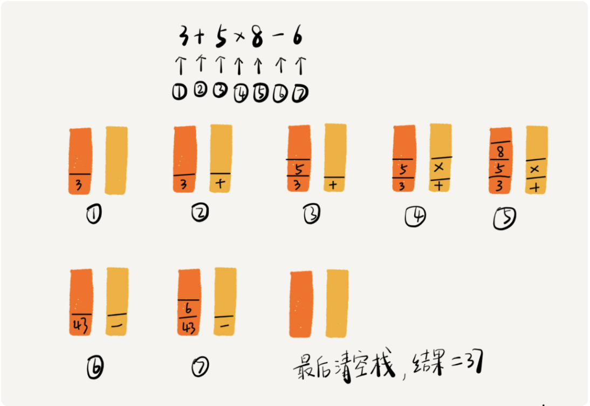

## 栈

后进者先出，先进者后出，这就是典型的“栈”结构

## 栈的实现

栈既可以用数组来实现，也可以用链表来实现。用数组实现的栈，我们叫作<font color=red>顺序栈</font>，用链表实现的栈，我们叫作<font color=red>链式栈</font>

java实现

```java
// 基于数组实现的顺序栈
public class ArrayStack { 
  private String[] items; // 数组 
  private int count; // 栈中元素个数 
  private int n; //栈的大小 
  
  // 初始化数组，申请一个大小为n的数组空间 
  public ArrayStack(int n) {
    this.items = new String[n];
    this.n = n;
    this.count = 0;
  }
  
  // 入栈操作
  public boolean push(String item) {
    // 数组空间不够了，直接返回false，入栈失败。 
    if (count == n) return false;
    // 将item放到下标为count的位置，并且count加一 
    items[count] = item;
    ++count;
    return true;
  } 
  
  // 出栈操作
  public String pop() { 
    // 栈为空，则直接返回null 
    if (count == 0) return null; 
    // 返回下标为count-1的数组元素，并且栈中元素个数count减一 
    String tmp = items[count-1];
    --count;
    return tmp;
  }
}
```

## 栈在函数调用中的应用

​	操作系统给每个线程分配了一块独立的内存空间，这块内存被组织成“栈”这种结构, 用来存储函数调用时的临时变量。每进入一个函数，就会将临时变量作为一个栈帧入栈，当被调用函数执行完成，返回之后，将这个函数对应的栈帧出栈

## 栈在表达式求值中的应用



## 栈在括号匹配中的应用